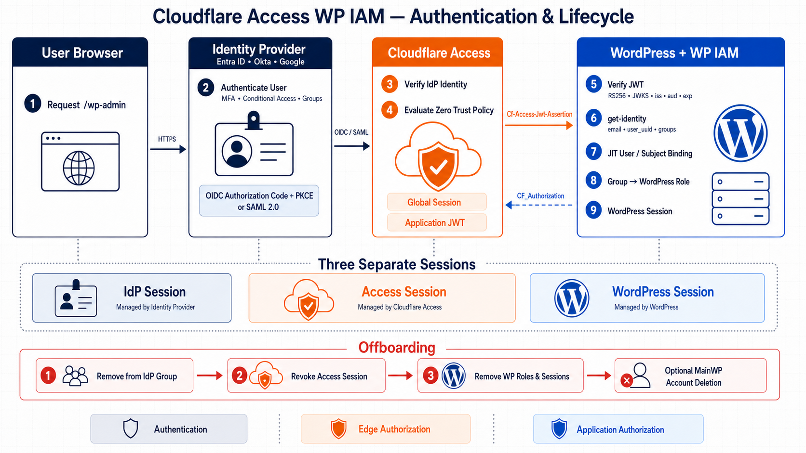

# Cloudflare Access WP IAM

Cloudflare Access WP IAM is a WordPress IAM/SSO gateway for administrative accounts. Cloudflare Access authenticates the user, the plugin validates the signed Access application token, and Cloudflare identity-provider groups are mapped to WordPress roles.

The plugin is IdP-agnostic. It can be used with Okta, Google Workspace, Microsoft Entra ID, generic SAML, or generic OIDC when Cloudflare Access returns a verified email, stable user ID, and group context.



The three trust layers are intentionally separate:

- the IdP performs authentication, MFA, and source group management over OIDC/OAuth 2.0 or SAML 2.0;
- Cloudflare Access evaluates the Zero Trust policy and issues an application-scoped, RS256-signed JWT;
- the plugin validates that JWT, obtains the full Cloudflare identity, performs JIT provisioning, and maps groups to WordPress roles.

See [ARCHITECTURE.md](ARCHITECTURE.md) for the complete login sequence, protocol boundaries, token validation, session model, JIT lifecycle, logout behavior, and fleet design.

## Version 2 security behavior

Version 2.0.2 is the hardened implementation of the Cloudflare trust model. Compared with the original release, it adds subject-bound managed accounts, fail-closed group synchronization, controlled migration of existing users, native-password and Application Password restrictions, protected REST handling, bounded diagnostics, JWKS rotation handling, and strict configuration validation. See [CHANGELOG.md](CHANGELOG.md) for the release history.

## Security model

Cloudflare Access is the external policy enforcement point. The WordPress plugin independently validates:

- the RS256 signature against Cloudflare JWKS;
- the fixed Cloudflare issuer derived from the team domain;
- the application AUD tag;
- token type, timestamps, email, subject, and identity nonce;
- the email and `user_uuid` returned by `get-identity` against the signed JWT;
- current group membership before provisioning or changing a role.

Managed accounts are permanently bound to the Cloudflare `sub`/`user_uuid`, not only to an email address. Their native WordPress password authentication, password resets, and Application Passwords are disabled.

Automation such as MainWP must use a separate, least-privileged unmanaged service account and a network path protected for that machine identity; do not reuse a managed human administrator.

No-match and lookup failure are deliberately different states:

- a successful identity lookup with no mapped group removes all WordPress roles, destroys sessions, deletes Application Passwords, and denies access;
- a failed or malformed Cloudflare identity lookup denies the current request without interpreting the failure as a group change.

Cloudflare Access group information reflects the Access identity session. After changing IdP groups, refresh or reauthenticate the Cloudflare identity before testing.

## Role mapping

The plugin reads the full identity from:

```text
https://<team>.cloudflareaccess.com/cdn-cgi/access/get-identity
```

It matches exact group IDs, names, or emails. Matching is case-insensitive. If several groups match, the highest WordPress role wins in this order:

```text
administrator > editor > author > contributor > subscriber
```

The secure default for an identity with no mapped group is `deny`. The only optional fallback is `subscriber`; privileged fallback roles are not accepted.

Clearing a mapping in the settings form removes it. Fleet imports replace the complete role map when a `groups` object is supplied.

## Account lifecycle

New users are created only after JWT, identity, and role authorization succeeds. A random unusable password is generated and the account is marked as Cloudflare-managed.

Existing WordPress accounts are not linked automatically by default. For a controlled migration:

When upgrading from 1.x, version 2 permits exactly one safe bootstrap link: the already authenticated WordPress user must be the same verified Cloudflare email and have an explicitly mapped group. That link consumes the upgrade flag. If there is no active matching WordPress session, use WP-CLI/MainWP to enable the migration setting deliberately.

1. Confirm that the Cloudflare email and mapped group are correct.
2. Temporarily set **Existing WordPress accounts** to **Allow one-time verified email linking**.
3. Let each intended account sign in once through Cloudflare Access.
4. Return the setting to **Do not link automatically**.

The first successful link stores the Cloudflare subject and destroys existing WordPress sessions and Application Passwords. A later subject mismatch revokes access and requires administrator intervention.

If Cloudflare legitimately issues a new subject after a user is removed and re-added to the Zero Trust organization, use an unmanaged break-glass administrator or WP-CLI to delete that user's `cfawpiam_managed` and `cfawpiam_subject` metadata, enable one-time linking, verify the new identity and mapped group, sign in once, and disable linking again. Never change only the stored subject by hand.

Keep at least one unmanaged, strongly protected break-glass administrator. Store its credentials securely and make its network path unavailable during normal operation. Never enable global email linking longer than the migration window.

The plugin performs JIT provisioning and access revocation; it does not implement SCIM or automatically delete the WordPress database row. Removing a user from an IdP group and revoking the Cloudflare session removes the access path. Delete dormant WordPress accounts separately through WordPress or MainWP after deciding how their content should be reassigned. Do not delete the MainWP connection user before moving the connection to another administrator.

## Installation

Requirements:

- WordPress 6.5 or newer;
- PHP 8.2 or newer;
- a Cloudflare-proxied hostname and Cloudflare Access application.

Install the release ZIP in WordPress or build from source:

```bash
composer install --no-dev --classmap-authoritative
```

The repository also includes the exact `firebase/php-jwt` 7.1.0 source required by the release, so the plugin can run without Composer on the WordPress host.

## WordPress configuration

Open:

```text
Settings -> Cloudflare Access WP IAM
```

Configure:

```text
Team domain: your-team.cloudflareaccess.com
Audience:     Cloudflare Access application AUD tag
```

The issuer, JWKS URL, and request-header name are derived and cannot be redirected to arbitrary hosts.

Then map groups, for example:

```text
wp-admins  -> administrator
wp-editors -> editor
```

The Site Health screen reports missing mappings, incomplete configuration, migration mode, and disabled REST enforcement. The settings screen retains the latest 50 bounded security events without tokens, cookies, or email addresses.

## Cloudflare configuration

At minimum, protect:

```text
/wp-admin
/wp-login.php
```

Also account for privileged entry points such as `admin-ajax.php`, `admin-post.php`, authenticated REST routes, and XML-RPC. Managed Application Passwords and native passwords are blocked by the plugin, and managed REST cookie requests require a valid Access token. Browser REST calls can validate the `CF_Authorization` application cookie when the Access header is absent; do not scope that cookie only to `/wp-admin` if the editor uses `/wp-json`.

The plugin cannot stop a request that reaches another vulnerable plugin before WordPress loads it. Production deployments must prevent direct origin access and ensure administrative traffic reaches the origin only through Cloudflare, preferably with Cloudflare Tunnel or authenticated origin controls.

See [CLOUDFLARE_CONFIGURATION.md](CLOUDFLARE_CONFIGURATION.md) for deployment details.

## Fleet automation

Settings can be imported as JSON or applied with `cfawpiam_apply_config()`:

```json
{
  "team_domain": "your-team.cloudflareaccess.com",
  "jwks_url": "https://your-team.cloudflareaccess.com/cdn-cgi/access/certs",
  "jwt_header": "Cf-Access-Jwt-Assertion",
  "issuer": "https://your-team.cloudflareaccess.com",
  "audience": "225e3c3d46aff0dc6cdf34f9b0ac4c0eee22624c80d557e67a2fbe2e82a03f17",
  "fallback_role": "deny",
  "existing_user_mode": "deny",
  "enforce_managed_rest": true,
  "logout_mode": "app",
  "groups": {
    "administrator": ["wp-admins"],
    "editor": ["wp-editors"]
  }
}
```

Derived values are accepted only when they exactly match the team domain. Group identifiers are configuration, not secrets. Never import API tokens, client secrets, SAML responses, JWTs, or cookies.

## Logout

- `app` redirects through the protected application hostname;
- `team` redirects to the validated `cloudflareaccess.com` team hostname, which is explicitly allowed by the WordPress safe-redirect filter;
- `disabled` ends only the WordPress session.

The default `app` mode ends the current WordPress and Cloudflare Access sessions. It does not end the upstream Entra, Okta, or Google session. A user who returns to `/wp-admin` may therefore be signed in again without a password prompt through normal SSO. Logout is not a substitute for group removal and administrative Access-session revocation.

Test logout behavior for your Access cookie configuration and session duration.

## Development and verification

```bash
composer install
composer lint
composer test
composer audit
```

Tests cover the security-sensitive normalization, JWT claims, group parsing, role priority, mapping replacement, and fail-closed configuration paths. Run integration tests against a disposable WordPress installation before production rollout.

## Data handling

The plugin does not store IdP passwords, SAML responses, OIDC tokens, Cloudflare JWTs, Cloudflare cookies, API tokens, client secrets, or private keys. It stores settings, group identifiers, a managed-account flag, the stable Cloudflare subject, and a bounded metadata-only security event log.

This project has not been independently audited. See [SECURITY.md](SECURITY.md) for the trust boundary and operational requirements.

## License

GPL-2.0-or-later. The bundled JWT library is BSD-3-Clause; see [THIRD_PARTY_NOTICES.md](THIRD_PARTY_NOTICES.md).
